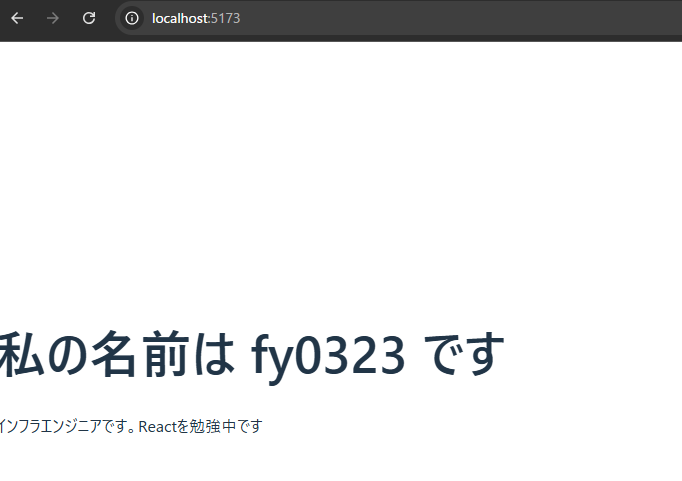

# Day8

Day7の課題、拝見しました。
完璧です！コマンドライン引数の扱いや、複数のAPIを順番に呼び出して得られたデータを整形して表示するロジック、エラーハンドリングまで、1週間の集大成として素晴らしい出来栄えです。

**特に良かった点**

  * `getUser`と`getPosts`で関数を適切に分離できており、コードが非常に読みやすいです。
  * 引数がない場合の考慮など、エッジケースのハンドリングもしっかりできています。

これで第1週は無事完了です。Webアプリ開発に必要な基礎体力がしっかり身につきましたね。本当にお疲れ様でした！

-----

さあ、今日から第2週です。いよいよユーザーの目に直接見える「**フロントエンド**」の世界に飛び込みます。今週は、現在最も人気のあるフロントエンドライブラリである **React** を使って、動的なWebページを構築する方法を学んでいきます。

### **【8日目】 React入門① 〜コンポーネントとJSX〜**

**本日のテーマ**:
Reactは「ユーザーインターフェースを構築するためのJavaScriptライブラリ」です。その最大の特徴は、UIを「**コンポーネント**」という再利用可能な部品の組み合わせとして考える点にあります。今日は、最新の開発ツール **Vite** を使ってReactの開発環境を立ち上げ、最も基本的な部品であるコンポーネントと、HTMLのように書ける不思議な構文 **JSX** を理解します。

-----

### **本日の達成目標**

1.  **Vite** を使って、TypeScript対応のReactプロジェクトを新規作成できる。
2.  **JSX** が「JavaScriptの拡張構文」であり、最終的にJavaScriptのコードに変換されることを説明できる。
3.  関数を使って、画面の一部（見出しなど）を表示するだけのシンプルな**Reactコンポーネント**を1つ作成できる。
4.  作成したコンポーネントを、メインの画面（`App.tsx`）に組み込んで表示できる。

-----

### **課題**

ViteでReactプロジェクトを作成し、自分で作った「自己紹介コンポーネント」を画面に表示してください。

**要件：**

1.  **プロジェクトのセットアップ**

      * ターミナルで `npm create vite@latest my-react-app -- --template react-ts` を実行し、`my-react-app` という名前のプロジェクトを作成します。（途中でプロジェクト名などを聞かれます）
      * 作成されたディレクトリに移動し、`npm install` を実行して依存パッケージをインストールします。

2.  **プロジェクトの掃除**

      * `src/App.tsx` ファイルを開き、`return (...)` の中身を一度空っぽの `<div></div>` だけにしてください。（既存のロゴやカウンターのコードは削除します）
      * `src/App.css` の中身も全て削除してOKです。

3.  **自己紹介コンポーネントの作成**

      * `src` フォルダ内に `components` という新しいディレクトリを作成します。
      * `src/components` の中に `Profile.tsx` という新しいファイルを作成します。
      * `Profile.tsx` の中で、`Profile` という名前の関数コンポーネントを定義してください。
      * このコンポーネントは、以下のようなJSXを返すようにします。
        ```jsx
        <div>
          <h1>私の名前は 山路 です</h1>
          <p>インフラエンジニアです。Reactを勉強中です！</p>
        </div>
        ```
        （名前や自己紹介文はご自身のものに変えてください）

4.  **コンポーネントの表示**

      * `src/App.tsx` ファイルで、先ほど作成した `Profile` コンポーネントを `import` します。
      * `App.tsx` の `return` 文の中（`<div>`タグの中）で、`<Profile />` のように記述して `Profile` コンポーネントを呼び出します。

5.  **実行と確認**

      * `npm run dev` コマンドで開発サーバーを起動します。
      * ブラウザで表示された `http://localhost:5173/` のようなURLにアクセスし、作成した自己紹介文が画面に表示されていることを確認してください。

**提出物:**
上記の要件を満たしたプロジェクト一式を、これまでと同じリポジトリの `day8` ブランチ、または `day8` ディレクトリなどに Push して、URL を教えてください。

-----

### **ヒント**

  * **JSXとは？**: HTMLによく似ていますが、JavaScriptのファイル（`.tsx`）内に直接書ける構文です。これにより、UIの見た目とロジックを近くに記述できます。ファイル拡張子が `.tsx` になるのは、このJSXが含まれていることを示すためです。

  * **コンポーネントの基本形**: Reactの関数コンポーネントは、「JSXを返す関数」です。大文字で始めるのがルールです。

    ```tsx:src/components/somecomponent.tsx
    // コンポーネントを定義
    function SomeComponent() {
      // 表示したいUI要素 (JSX) を return する
      return <h2>これはコンポーネントです。</h2>;
    }

    // 他のファイルで使えるように export する
    export default SomeComponent;
    ```

バックエンドからフロントエンドへ、思考の切り替えが必要になるかもしれませんが、自分の書いたコードが直接ブラウザに表示されるのはとても楽しい体験です。頑張ってください！


# result

```sh
npm run dev

> my-react-app@0.0.0 dev
> vite


  VITE v7.1.5  ready in 379 ms

  ➜  Local:   http://localhost:5173/
  ➜  Network: use --host to expose
  ➜  press h + enter to show help

```

