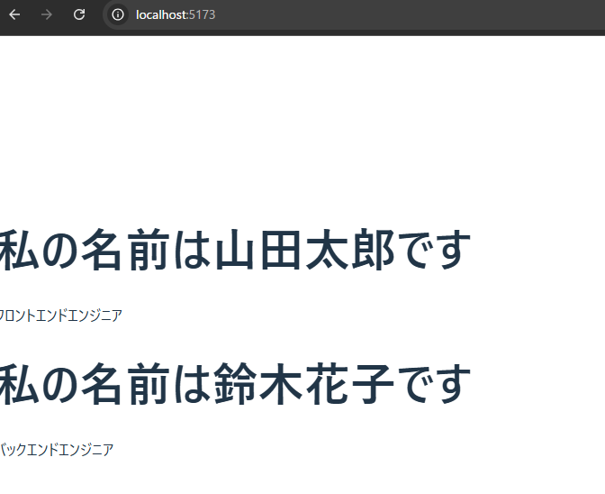
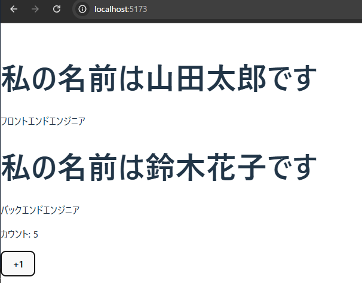

# Day9

Day8の課題、確認しました。
Viteでのプロジェクト作成から、初めてのコンポーネント作成、そしてAppコンポーネントへの組み込みまで、完璧な流れで実装できていますね！React開発の第一歩、見事にクリアです。

それでは今日は、静的なコンポーネントを**動的**に変えるための、Reactで最も重要な2つの概念「**Props**」と「**State**」を学びます。

-----

### **【9日目】 React入門② 〜PropsとState〜**

**本日のテーマ**:
昨日は決まった内容を表示するだけのコンポーネントを作りましたが、実際のアプリでは外部から渡されるデータに応じて表示を変えたり、ユーザーの操作に応じて表示を更新したりする必要があります。そのために使うのが **Props** と **State** です。

  * **Props (プロップス)**: 親コンポーネントから子コンポーネントへデータを渡すための仕組みです。「**プロパティ**」の略で、関数の**引数**のようなものだと考えてください。
  * **State (ステート)**: コンポーネントが内部で保持・管理する、時間と共に変化する可能性のあるデータです。コンポーネント自身の「**状態**」や「**記憶**」だと考えてください。

-----

### **本日の達成目標**

1.  **Props** を使って、親から子へデータを渡し、子の表示を動的に変更できる。
2.  TypeScriptの `interface` を使って、コンポーネントが受け取るPropsの型を定義できる。
3.  **`useState` フック**を使って、コンポーネントに **State** を持たせることができる。
4.  ボタンの `onClick` イベントを使い、ユーザーのアクションに応じてStateを更新し、画面の表示を再レンダリングさせることができる。

-----

### **課題**

昨日の自己紹介アプリを拡張し、PropsとStateを使ったカウンター機能を追加してください。

#### **Part 1: Propsで自己紹介を使い回す**

1.  **`Profile.tsx` の修正**

      * `Profile` コンポーネントが `name` (文字列)と `bio` (文字列)という2つのPropsを受け取るように修正します。
      * コンポーネントの先頭で、受け取るPropsの型定義を `interface` を使って作成してください。
      * 昨日ハードコーディング（直接記述）した名前と自己紹介文を、Propsから受け取った `name` と `bio` を表示するように変更してください。

2.  **`App.tsx` の修正**

      * `Profile` コンポーネントを**2回**呼び出します。
      * それぞれに異なる `name` と `bio` をPropsとして渡してください。これにより、同じコンポーネントを使い回して異なる情報を表示できることを確認します。

#### **Part 2: Stateでカウンターを作成する**

1.  **`Counter.tsx` コンポーネントの新規作成**

      * `src/components` ディレクトリに `Counter.tsx` という新しいファイルを作成します。
      * `Counter` という関数コンポーネントを定義します。
      * `useState` フックを使い、`count` という名前のStateを定義し、初期値を `0` に設定します。
      * JSXで、現在の `count` の値を表示する `<p>` タグと、「+1」と書かれた `<button>` タグを記述します。
      * ボタンがクリックされたら、`count` の値が1増えるように `onClick` イベントとStateの更新関数を実装してください。

2.  **`App.tsx` での表示**

      * 作成した `Counter` コンポーネントを `App.tsx` にインポートし、`Profile` コンポーネントの下に表示してください。

**提出物:**
上記の要件を満たしたプロジェクト一式を、これまでと同じリポジトリの `day9` ブランチ、または `day9` ディレクトリなどに Push して、URL を教えてください。

-----

### **ヒント (動作確認済みのコード例)**

#### **Propsの扱い方**

```tsx:src/components/profile.tsx
// 1. Propsの型を定義
interface ProfileProps {
  name: string;
  bio: string;
}

// 2. 関数の引数でPropsを受け取る (分割代入を使うと便利)
function Profile({ name, bio }: ProfileProps) {
  return (
    <div>
      <h1>私の名前は {name} です</h1>
      <p>{bio}</p>
    </div>
  );
}

export default Profile;
```

```tsx:src/app.tsx
import Profile from './components/Profile';

function App() {
  return (
    <div>
      <Profile name="山田 太郎" bio="フロントエンドエンジニアです。" />
      <Profile name="鈴木 花子" bio="デザイナーです。趣味は旅行です。" />
    </div>
  );
}
```

#### **Stateとイベントの扱い方**

```tsx:src/components/counter.tsx
import { useState } from 'react'; // useStateをインポート

function Counter() {
  // 1. stateを定義。countが現在の値、setCountが更新用の関数
  const [count, setCount] = useState(0);

  // 2. ボタンがクリックされたときに呼ばれる関数
  const increment = () => {
    setCount(count + 1); // setCountを呼ぶとstateが更新され、再レンダリングが走る
  };

  return (
    <div>
      <p>現在のカウント: {count}</p>
      {/* 3. ボタンのonClickに関数を渡す */}
      <button onClick={increment}>+1</button>
    </div>
  );
}

export default Counter;
```

PropsとStateはReactを使いこなす上で最も重要な心臓部です。この課題を通して、その動きをしっかり体感してください。頑張りましょう！

# result


