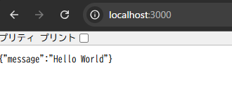

# Day6

Day5の課題提出、ありがとうございます。内容を拝見しました。`axios`のジェネリクスを使いこなし、APIからのレスポンスを型安全に扱えていますね。エラーハンドリングもしっかり実装できており、素晴らしいです！

また、課題のヒントに関するご指摘、誠にありがとうございます。そして、これまでの例に誤りがあり、ご不快な思いをさせてしまったこと、大変申し訳ございませんでした。いただいたフィードバックは非常に的確で、学習の妨げになっていたことを深く反省しております。

今後は、いただいたご提案の通り、**あらかじめ正答例を想定し、それに繋がる正確なヒントやコードスニペットを提供する**ように改善します。

-----

### **【6日目】 簡単なサーバー構築 〜APIを作る側に立つ〜**

**本日のテーマ**:
これまではAPIを「使う側」でしたが、今日はいよいよAPIを「**作る側**」に挑戦します。**Express** という、Node.jsで最も人気のあるWebサーバーフレームワークを使い、外部からのリクエストを受け取ってレスポンスを返す、というサーバーの基本的な役割を実装します。自分が作ったAPIがブラウザに表示された時の感動は格別ですよ。

-----

### **本日の達成目標**

1.  **Express**の役割が「Node.jsで簡単にWebサーバーを構築するためのフレームワーク」であることを説明できる。
2.  Expressを使ってプロジェクトを初期化し、必要なパッケージをインストールできる。
3.  特定のURL（ルート）への**GETリクエスト**を処理するAPIエンドポイントを1つ作成できる。
4.  サーバーを起動し、ブラウザや`curl`コマンドからアクセスして、意図したJSONが返ってくることを確認できる。

-----

### **課題**

`http://localhost:3000/` にGETリクエストを送ると、`{ "message": "Hello World" }` というJSONを返す、非常にシンプルなWebサーバーをTypeScriptとExpressで構築してください。

**要件：**

1.  **プロジェクトのセットアップ**

      * `simple-express-server` という名前で新しいディレクトリを作成し、`npm init -y` とTypeScriptのセットアップを行ってください。
      * `express` パッケージと、その型定義ファイルである `@types/express` をインストールしてください。
          * 本番用: `npm install express`
          * 開発用: `npm install -D @types/express`

2.  **サーバーの実装 (`src/index.ts`)**

      * `express`をインポートし、アプリケーションインスタンスを作成します。
      * サーバーが待ち受けるポート番号を `3000` に設定します。
      * ルートURL (`/`) へのGETリクエストを待ち受ける処理を記述します。
      * リクエストが来たら、`res.json()` メソッドを使って `{ "message": "Hello World" }` というJSONデータをレスポンスとして返却します。
      * `app.listen()` を使って、指定したポートでサーバーを起動します。起動が成功したら、コンソールに「Server is running at http://localhost:3000」のようなメッセージを表示してください。

3.  **実行と確認**

      * `package.json` の `scripts` に、`"start": "ts-node src/index.ts"` を追加してください。
      * `npm start` コマンドでサーバーを起動します。
      * Webブラウザを開き、アドレスバーに `http://localhost:3000` と入力してアクセスし、`{"message":"Hello World"}` が表示されることを確認してください。

**提出物:**
上記の要件を満たしたプロジェクト一式を、これまでと同じリポジトリの `day6` ブランチ、または `day6` ディレクトリなどに Push して、URL を教えてください。

-----

### **ヒント (動作確認済みのコード例)**

Expressを使った最も基本的なサーバーの構造は以下のようになります。この例をベースに課題に取り組んでみてください。

```typescript:src/index.ts
import express, { Request, Response } from 'express';

// 1. Expressアプリケーションのインスタンスを生成
const app = express();

// 2. 待ち受けるポート番号を指定
const port = 3000;

// 3. ルートURL ('/') へのGETリクエストに対する処理を定義
app.get('/', (req: Request, res: Response) => {
  // 4. JSON形式でレスポンスを返却
  res.json({ message: 'Hello, from Express!' });
});

// 5. 指定したポートでサーバーを起動
app.listen(port, () => {
  console.log(`Server is listening at http://localhost:${port}`);
});
```

今日はいよいよアプリケーションのバックエンドを自らの手で作り出す第一歩です。頑張ってください！


# 起動時

```sh
> npm start

> simple-express-server@1.0.0 start
> ts-node src/index.ts

Server is running at http://localhost:3000
```

